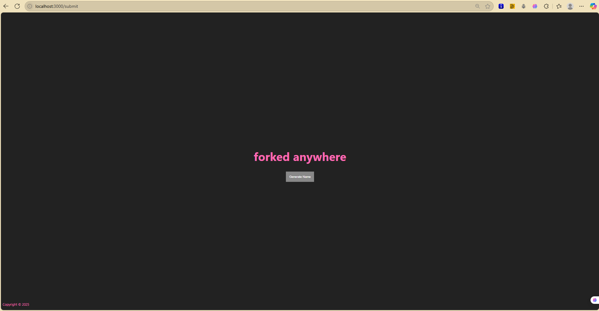

# Band Name Generator

A simple Node.js and Express web app that generates creative band names by combining random adjectives and nouns. Built using Express, EJS templating, and styled with CSS.

## Features

- Generates a unique band name on button click
- Dynamic rendering with EJS templates
- CSS styling served as static files
- Dynamic footer displaying the current year automatically

## Demo

  
*(Replace with your actual screenshot if available)*

## Getting Started

### Prerequisites

- [Node.js](https://nodejs.org/en/) installed (version 12 or higher recommended)
- npm (comes with Node.js)

### Installation

1. Clone the repository:

   ```bash
   git clone https://github.com/yourusername/band-name-generator.git
   cd band-name-generator
## 2. Install dependencies:
```bash
npm install
```
## 3. Run the app:
```bash
node app.js
```
## 4.Open your browser and navigate to:
```bash
http://localhost:3000
```
## Project Structure
```bash
/public
  /styles
    main.css          # CSS styles
/views
  /partials
    header.ejs       # Head section with CSS link
    footer.ejs       # Footer with dynamic year
  index.ejs          # Main page
app.js               # Express server setup
package.json
README.md
```
## How It Works
Express serves static files (CSS) from the public folder.

The main view index.ejs includes partials for header and footer.

Clicking the "Generate Band Name" button sends a POST request that creates a random band name.

The footer dynamically displays the current year using JavaScript inside EJS: <%= new Date().getFullYear() %>.

## Technologies Used
Node.js

Express.js

EJS (Embedded JavaScript templates)

CSS

## License
This project is licensed under the MIT License.
